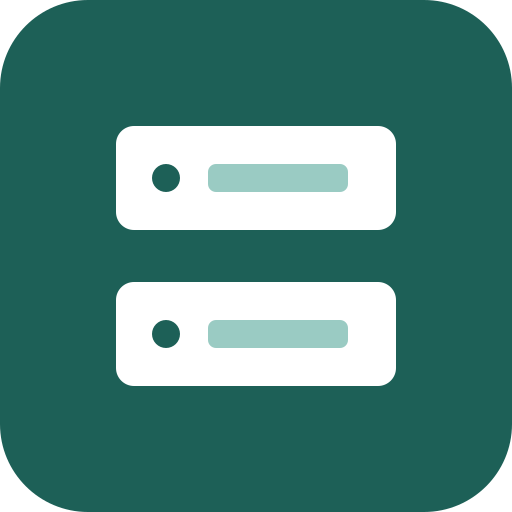

# PortLens

<p align="center">
  
</p>

<p align="center">
  看清本地端口背后的进程，并安全地释放被占用的开发端口。
</p>

<p align="center">
  <a href="https://github.com/xirfly/portlens/actions/workflows/ci.yml"></a>
  <a href="https://github.com/xirfly/portlens/releases/latest"></a>
  
  
  
  
</p>

PortLens 是一个面向开发者的本地端口与进程管理工具。它读取 TCP 监听端口和 UDP 绑定端点，定位对应进程，并在确认后结束不再需要的进程树。

当前版本基于 **Tauri 2 + Rust + React/TypeScript**，仅在 **Windows 11** 上完成开发和验证。

## 为什么开发 PortLens

本地开发经常会遇到这些情况：

- 重启服务时提示 `EADDRINUSE` 或“端口已被占用”，却不知道占用者是谁。
- 同一个项目被重复启动，终端已经关闭，但 Node、Python、Java 等子进程仍在后台运行。
- `netstat`、PowerShell、任务管理器分别只能提供一部分信息，需要在端口、PID 和进程之间来回核对。
- 直接按 PID 结束进程时，很难判断它是否属于系统、它还占用了哪些端口，以及是否会留下子进程。
- 不同语言、不同运行时的开发服务分散在系统进程列表中，查找成本高。

PortLens 希望把这条排查链路压缩成一个界面：

```text
端口 -> PID -> 应用 / 路径 / 命令行 -> 确认 -> 结束进程树
```

它不是通用任务管理器，也不是网络扫描器。它专注于一个高频问题：**快速判断谁占用了本机端口，并在明确风险后释放端口。**

## 主要功能

- 读取 IPv4/IPv6 的 TCP 监听端口和 UDP 绑定端点
- 按 PID 聚合端口，避免同一进程重复占据多行
- 展示应用名、PID、协议、端口、启动时间、可执行文件和命令行
- 提供“开发 / 用户 / 全部”三档进程范围
- 自动识别 Node.js、Python、Java、Go、Rust、.NET、PHP、Docker 等常见开发运行时
- 支持按应用、PID、端口、路径和命令行搜索
- 每 5 秒自动刷新，也可随时手动刷新
- 支持单个或批量结束进程树
- 在操作前展示受影响进程和将释放的端口，并要求二次确认

## 安全边界

端口本身不能被单独“结束”。端口属于进程，因此释放端口意味着结束持有它的进程；该进程占用的其他端口也会同时释放。

PortLens 对结束操作设置了多层保护：

- PID `0`、PID `4` 和 PortLens 自身进程不可结束
- Windows 核心进程名称不可结束
- 位于 Windows 系统目录中的程序不可结束
- 系统进程在界面中不可选择
- 所有结束操作都需要用户确认
- Windows 后端使用 `taskkill /T /F` 结束目标进程及其子进程

这些保护只能降低误操作风险，不能替代用户判断。结束进程前请确认目标程序中的数据已经保存；部分进程可能需要管理员权限。

## 隐私

PortLens 在本机读取端口和进程信息，不上传扫描结果，也不包含遥测或账户系统。应用的内容安全策略仅允许加载本地资源。

## 下载与运行

正式版本发布在 [GitHub Releases](https://github.com/xirfly/portlens/releases)。下载最新版本的 `PortLens.exe` 后可直接运行，无需安装。每个版本同时提供 `PortLens.exe.sha256`，可用于验证文件完整性。

Windows 11 通常已经包含 WebView2 Runtime。未签名的早期版本可能触发 Microsoft Defender SmartScreen 提示，请只从本项目的 GitHub Releases 下载，并在运行前核对发布说明和文件哈希。

## 开发环境

需要安装：

- Node.js 20 或更高版本
- Rust stable MSVC toolchain
- Visual Studio 2022 Build Tools
- `Desktop development with C++` 工作负载
- Windows SDK
- WebView2 Runtime

安装前端依赖：

```powershell
npm ci
```

启动开发环境：

```powershell
npm run tauri dev
```

如果常规终端无法定位 MSVC，请从 **x64 Native Tools Command Prompt for VS 2022** 运行该命令。

## 测试与构建

运行 Rust 单元测试和 Windows 端到端测试：

```powershell
cd src-tauri
cargo test
cd ..
```

检查 TypeScript 并构建前端：

```powershell
npm run build
```

构建 Windows 便携版：

```bat
build-windows.cmd
```

脚本会安装锁定版本的 npm 依赖、初始化 MSVC（如果当前终端尚未初始化）、构建 release，并复制出根目录的 `PortLens.exe`。如果 Visual Studio 无法被自动发现，可以指定 `vcvars64.bat`：

```bat
set PORTLENS_VCVARS=D:\path\to\VC\Auxiliary\Build\vcvars64.bat
build-windows.cmd
```

构建成功后会生成：

```text
PortLens.exe
src-tauri\target\release\portlens.exe
```

默认构建使用 `--no-bundle`，只生成便携版，不下载 NSIS 工具包。发布用二进制不应提交到源码仓库，而应作为 GitHub Release 附件发布。

## 发布新版本

发布脚本会同步 npm、Tauri 和 Cargo 的版本号，在本机完成 release 构建，然后创建版本提交和 Git 标签。标签推送后，GitHub Actions 会在干净的 Windows Runner 上重新测试和构建，并自动把以下文件发布到 Releases：

```text
PortLens.exe
PortLens.exe.sha256
```

确保当前位于干净的 `main` 分支，并已配置 GitHub 网络代理和推送权限，然后执行：

```powershell
.\release.ps1 0.2.0
```

版本号必须遵循语义化版本规范。常用递增方式：

- 修复问题：`0.1.0 -> 0.1.1`
- 向后兼容的新功能：`0.1.0 -> 0.2.0`
- 不兼容变更：`0.x -> 1.0.0`

也可以手动执行 `npm run version:set -- 0.2.0` 更新版本，提交后创建并推送 `v0.2.0` 标签。GitHub Release 工作流只接受与项目版本完全一致的标签。

## 技术实现

```text
src/                    React/TypeScript 界面
src-tauri/src/ports.rs  端口扫描、进程保护和结束进程树
src-tauri/              Tauri/Rust 应用与打包配置
.github/                CI、Issue 与 Pull Request 模板
```

Rust 后端通过系统 API 获取端口与 PID 的映射，不解析受系统语言影响的 `netstat` 文本。前端只通过受控的 Tauri commands 请求端口列表或结束指定进程。

## 当前限制

- 当前仅在 Windows 11 上完成验证
- 进程路径或命令行可能因权限不足而无法读取
- 结束受保护进程或高权限进程时可能被系统拒绝
- 当前没有端口历史、占用提醒或后台托盘模式
- macOS 和 Linux 尚未实现各自的进程保护与进程树结束策略

## 路线图

- 完善代码签名和可信发布链
- 增加端口占用变化提醒与可选历史记录
- 改进开发运行时识别规则和用户自定义规则
- 在 macOS 和 Linux 上实现并验证对应后端
- 增加更多自动化测试和可访问性检查

路线图不代表交付承诺。功能建议请使用 GitHub Issues，并说明实际使用场景。

## 参与贡献

Bug 报告、功能建议、文档改进和代码贡献都可以通过 GitHub Issues 与 Pull Requests 提交。开始前请阅读 [CONTRIBUTING.md](CONTRIBUTING.md)。

安全问题请不要提交公开 Issue，请按照 [SECURITY.md](SECURITY.md) 中的方式私下报告。

## 开源协议

PortLens 使用 [MIT License](LICENSE)。你可以使用、复制、修改、合并、发布和分发本项目，但必须保留原始版权声明和许可证文本。
